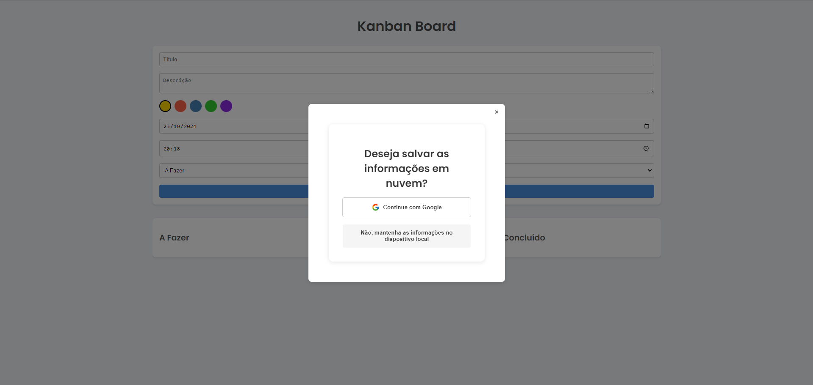
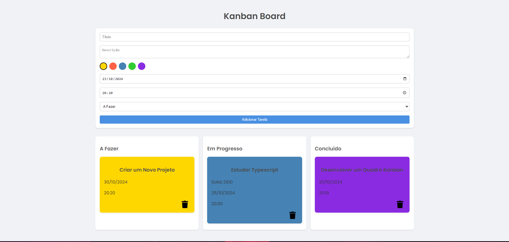

# Kanban Board

Um quadro Kanban simples e responsivo, desenvolvido com **React**, **TypeScript**, e **Vite**. Permite criar, editar e excluir tarefas, com a possibilidade de adicionar descrição, prazo e horário, escolher a cor de cada tarefa, e organizar em diferentes categorias.

## 📋 Funcionalidades

- Adicionar tarefas com título, descrição, data e hora limite.
  
- Escolher a cor do card para cada tarefa.
  
- Organizar tarefas nas categorias:
  - **A fazer**
  - **Em progresso**
  - **Concluído**
  
- Remover tarefas.
  
- **Login com Google**: É possível fazer login utilizando sua conta do Google e salvar as tarefas em nuvem.
  
- Manter as tarefas salvas somente no dispositivo local.
  

## 🛠️ Tecnologias Utilizadas

- **React** + **Vite**: Para construção do frontend.
- **TypeScript**: Tipagem estática e melhorias de desenvolvimento.
- **Firebase**: Para autenticação e integração com Firestore e Firebase Authentication.

## 🚀 Como Rodar o Projeto

### Pré-requisitos

- **Node.js** e **npm** instalados.

### Passo a passo

1. Clone o repositório:
   ```bash
   git clone https://github.com/MatheusLetra/KanbanBoard.git
   cd KanbanBoard
   ```

2. Crie um arquivo `.env` na raiz do projeto com suas credenciais do Firebase:
   ```env
   VITE_API_KEY=your_api_key
   VITE_AUTH_DOMAIN=your_auth_domain
   VITE_PROJECT_ID=your_project_id
   VITE_STORAGE_BUCKET=your_storage_bucket
   VITE_MESSAGING_SENDER_ID=your_messaging_sender_id
   VITE_APP_ID=your_app_id
   ```

3. Instale as dependências:
   ```bash
   npm install
   ```

4. Inicie o servidor de desenvolvimento:
   ```bash
   npm run dev
   ```

5. Acesse o projeto em seu navegador:
   ```
   http://localhost:5173
   ```

6. Para acessar a versão de produção do projeto, visite:
   ```
   https://kanbantasksboard.netlify.app/
   ```

## 📝 Estrutura do Projeto

```bash

src/
|-- components/
|   |-- TaskForm.tsx       # Formulário para adicionar novas tarefas
|   |-- Card.tsx           # Componente para exibir cada tarefa
|   |-- Column.tsx         # Componente para agrupar as tarefas em colunas de acordo com o status
|   |-- Column.tsx         # Componente para agrupar os tipos de coluna disponíveis (A Fazer, Em Progresso e Concluído)

|-- pages/
|   |-- Home/
|      |-- Home.tsx        # Página que organiza todos os componentes relacionados as tasks
|      |-- Home.css        # Estilização da Página Home.tsx
|   |-- Login/
|      |-- Login.tsx       # Página que agrupa as funções de Login (Google)
|      |-- Login.css       # Estilização da Página Login.tsx

|-- services/
|   |-- firebase-config.ts # Cria o Client do Firebase e cria as instâncias dos serviços de autenticação e de armazenamento (Firebase Authentication e Firebase Firestore)
|   |-- firestore.ts       # Agrupa as funções relacionadas a persistência dos dados no Firebase Firestore

|-- types/
|   |-- Task.ts            # Interface da Entidade de Tarefa

|-- utils/
|   |-- firestore-functions.ts  # Utiliza as funções do Firestore
|   |-- localstorage.ts         # Funções relacionadas ao armazenamento dos dados no dispositivo local

|-- App.tsx                # Componente principal padrão do React
|-- index.css              # Estilos globais
|-- types.ts               # Tipos utilizados no projeto
|-- main.tsx               # Ponto de entrada do React
|-- index.html             # HTML base com importação da fonte
```

## 🖌️ Estilo e Personalização

- A fonte padrão utilizada é a **Poppins**, carregada via Google Fonts.
- Estilos personalizados para cards, formulário e botões são definidos nos arquivos `.css` dentro da pasta `/pages`, permitindo ajustes rápidos de design.

## 🗑️ Remover Tarefas

Para remover uma tarefa, clique no botão "Excluir" no card da tarefa desejada.

## 💾 Persistência de Dados

As tarefas são salvas no `localStorage`, garantindo que os dados permaneçam mesmo após o recarregamento da página. A funcionalidade de salvar tarefas no Firestore está disponível somente para usuários que optarem por fazer login com a conta google.

## 📷 Screenshots




## 📄 Licença

Este projeto está licenciado sob a licença MIT. Consulte o arquivo [LICENSE](./LICENSE) para obter mais informações.
